# Agentic AI Financial Analyst — Streamlit App

> **One-click stock screening + concise company summaries (FMP + GPT).**  
> Screens a U.S. universe, fetches company profiles, and generates compact 1–3 line summaries per ticker in a clean card layout. Built to expand into an **agentic research assistant** with scoring, optimization, and backtesting.
> https://huggingface.co/spaces/andrewnap211/agentic-ai-financial-analyst

---

## ✨ Current Features (v0.1)

- **Server-side screening (FMP):** Sector, market cap, volume, active trading; pagination + graceful retries.
- **Profile fetch (FMP v3):** Company name, sector, industry, description.
- **LLM summaries (OpenAI):** Up to **3 concise lines**, *no filler*, using only the FMP description.
- **Card/grid UI (Streamlit):** Full text (no truncation), adjustable cards per row, CSV export.
- **Caching:** `@st.cache_data` for screeners/profiles to reduce API calls.

---

## 🧭 Quick Demo Flow

1. Choose **Sector**, **Min Market Cap**, **Min Volume**, **Max companies** in the sidebar.  
2. Click **Run screen + summarize**.  
3. Review screened tickers (table) and **summary cards** below.  
4. Optionally edit the **prompt** to steer tone/detail.  
5. **Download CSV** of ticker/name/summary.

---

## 🧱 Project Structure

```
app.py                  # Streamlit UI + core logic (screener, profiles, summaries, cards)
requirements.txt        # Python deps (Streamlit, requests, pandas, openai, urllib3)
README.md               # You are here
```

---

## 🔌 Data & APIs

| Source | Purpose | Endpoints (examples) |
| --- | --- | --- |
| **Financial Modeling Prep (FMP)** | Screener + company profiles | `/stable/company-screener`, `/api/v3/profile/{ticker}` |
| **OpenAI** | Summaries using description only | Chat Completions (`gpt-4o-mini` by default) |

> **Note:** The app instructs the model to use **only** the provided description (no outside facts).

---

## ⚙️ Configuration

Set your keys via environment variables or HF **Repository Secrets**:

- `FMP_API_KEY`
- `OPENAI_API_KEY`
- (Optional) `OPENAI_MODEL` (defaults to `gpt-4o-mini`)

**Tip:** In `app.py` you can allow Secrets to override hardcoded values:

```python
FMP_API_KEY    = os.getenv("FMP_API_KEY")    or FMP_API_KEY
OPENAI_API_KEY = os.getenv("OPENAI_API_KEY") or OPENAI_API_KEY
```

---

## ▶️ Run Locally

```bash
python -m venv .venv && source .venv/bin/activate   # (Windows: .venv\Scripts\activate)
pip install -r requirements.txt
export FMP_API_KEY=xxxx
export OPENAI_API_KEY=sk-xxxx
streamlit run app.py
```

Open the URL Streamlit prints (usually `http://localhost:8501`).

---

## 🚀 Deploy to Hugging Face Spaces

1. Create a **Streamlit** Space (name like `agentic-ai-financial-analyst`).  
2. Upload:
   - `app.py`
   - `requirements.txt`
3. In **Settings → Repository secrets**, add:
   - `FMP_API_KEY`
   - `OPENAI_API_KEY`
4. The Space builds and serves the app automatically.

**Sample `requirements.txt`:**
```
streamlit>=1.31
pandas>=2.0
requests>=2.31
urllib3>=1.26,<3
openai>=1.37.0
```

---

## 🧠 How It Works (high level)

```mermaid
flowchart LR
  A[Sidebar Filters] --> B[Screen: FMP /stable/company-screener]
  B --> C[Tickers]
  C --> D[Profiles: FMP /api/v3/profile/&#123;ticker&#125;]
  D --> E[Summarize: OpenAI Chat Completion]
  E --> F[Streamlit Card/Grid UI]
  F --> G[CSV Export]
```



1. **Screen** – `fmp_company_screener_safe()` calls FMP with retries + paging; normalizes `symbol → ticker`.  
2. **Fetch profiles** – `fetch_profiles_v3_bulk()` requests `/api/v3/profile/{ticker}`; polite sleeps to avoid 429.  
3. **Summarize** – `summarize_description()` sends description text to OpenAI with strict instructions (≤3 lines, no filler).  
4. **Render** – Cards use HTML/CSS in `st.markdown(..., unsafe_allow_html=True)` to avoid truncation.

---

## 🧩 Key Design Choices

- **Graceful failure**: returns partial results; captures warnings/errors; avoids crashing on rate limits.  
- **Deterministic-ish LLM**: low temperature; clear constraints reduce drift.  
- **No hallucinations**: summaries must use **only** the profile description.  
- **Token control**: descriptions are clipped (~4k chars) before sending to the model.

---

## 🗺️ Roadmap → Agentic Analyst

### Phase 1 — Metrics & Scoring
- **Metrics pipeline:**  
  - FMP: `ratios-ttm`, `income-statement` (annual), `cash-flow-statement`, `analyst-estimates`, `price-target-consensus`  
  - yfinance: returns, annualized vol, VaR/CVaR  
- **Derived features:** Fwd PS/PE, EPS Δ, 3Y CAGR (Rev/NI/OCF/FCF), margin expansion, risk metrics.  
- **Weighted scoring:** Sidebar sliders → normalized score → ranked table + “Why this stock?” bullets tied to actual metrics.

### Phase 2 — Portfolio & Backtest
- **Optimizer:** mean-variance (max Sharpe, min var, target return), long-only + cap constraints.  
- **Backtesting:** monthly/quarterly rebalance; equity curve vs SPY; CAGR, Sharpe, vol, max DD.  
- **Exports:** CSV/JSON; optional PDF research brief.

### Phase 3 — Agent Console (Tool Calling)
- Expose tool functions: `screen()`, `profiles()`, `features()`, `score()`, `optimize()`, `backtest()`.  
- GPT plans steps → calls tools → returns answer + **trace** (which tools, args, rows, timing).  
- **Query examples:**  
  - “Find US software peers with ≥15% FCF CAGR and ≤6x Fwd PS; propose a low-vol portfolio.”  
  - “Rank mid-cap energy names by growth & valuation, cap any name at 10%, rebalance quarterly.”

### Phase 4 — Production polish
- Presets save/load, session persistence.  
- Airflow (or HF cron) to precompute snapshots.  
- Data provenance banners (freshness, source).  
- Accessibility & performance tuning.

---

## 🧪 Testing Ideas

- Unit tests for: param sanitization, CAGR math (signed), normalization/scoring, optimizer constraints.  
- Mock FMP/LLM to keep tests offline and fast.

---

## 🔐 Security & Costs

- Prefer **Secrets** over hardcoding keys—especially for public Spaces.  
- Add caching to cut costs (LLM + FMP).  
- This app is **not financial advice**; include a small disclaimer in the footer.

---

## ❓ Troubleshooting

- **Blank page** → check **Runtime → Logs**; often a missing package or model/key issue.  
- **429 from FMP** → already retried; try lower limits or slower cadence.  
- **OpenAI auth error** → ensure `OPENAI_API_KEY` is set in Secrets or hardcoded for testing.  
- **Text truncated** → use the **card layout** (already implemented); tables tend to truncate long cells.

---

## 📄 License

Choose a license that fits (e.g., MIT). Add `LICENSE` to the repo if you plan to share publicly.

---

## 🙌 Acknowledgments

- [Financial Modeling Prep](https://financialmodelingprep.com/) for market data.  
- [Streamlit](https://streamlit.io/) for rapid UI.  
- [OpenAI](https://platform.openai.com/) for language models.

---

## 📝 Changelog

- **v0.1** — Initial MVP: Screener → Profiles → GPT summaries with card layout & CSV export.
